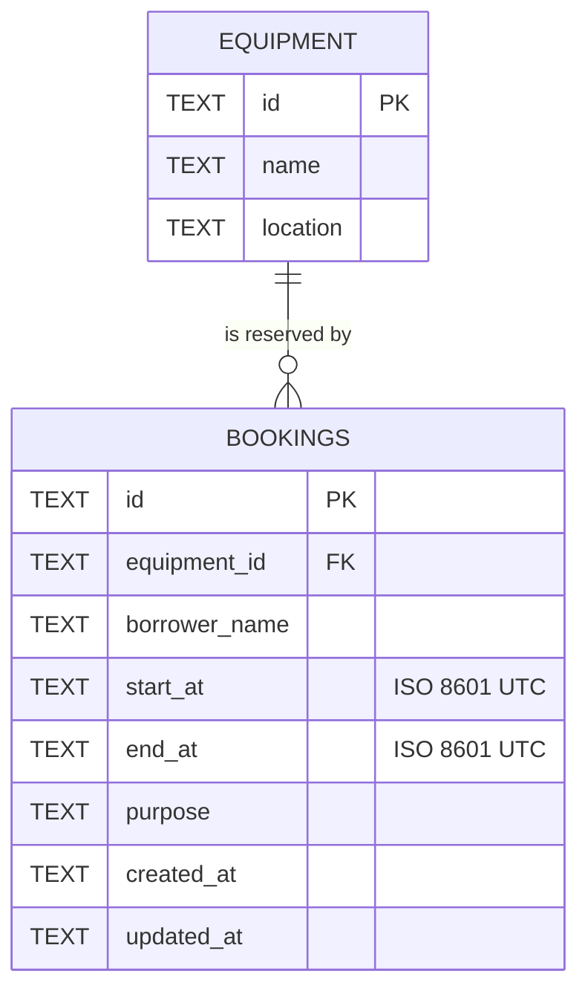

# API Contract - Campus Equipment Booking API

**Base URL:** `http://localhost:5000/api`
**Content type:** `application/json` for all request and response bodies (except `204` which has no body).
**CORS:** enabled for all origins.

## Assumptions

1. Timestamps are ISO 8601 date-times **with a timezone** (`Z` or `+07:00`) and are stored/returned in UTC (`...T09:00:00.000Z`).
2. Overlap means `existing.startAt < new.endAt AND existing.endAt > new.startAt` for the **same** equipment. A booking that starts exactly when another ends is allowed (back-to-back).
3. `equipmentId` that does not exist is **invalid input in the body** -> `400` (the URL itself is valid). `404` is reserved for a resource addressed by URL/ID that does not exist (`/bookings/:id`).
4. `PATCH` is a partial update: omitted fields keep their value; the merged result is re-validated (including overlap, excluding the booking itself).
5. `purpose` is optional (defaults to empty string). `borrowerName` max 100 chars, `purpose` max 500 chars.
6. Unknown fields in a request body are rejected (`400`) rather than silently ignored.
7. Equipment is read-only seed data (`eq-1` Projector A, `eq-2` Camera Canon R6, `eq-3` Meeting Room 301); only `GET /equipment` is required by the brief.
8. Booking IDs are server-generated (`bk-<uuid>`).

## Endpoints

### GET /equipment -> 200

```json
[
  { "id": "eq-1", "name": "Projector A", "location": "Building 1" }
]
```

### GET /bookings -> 200

Optional query: `?equipmentId=eq-1`. Returns an array ordered by `startAt`.

### GET /bookings/:id -> 200 | 404

### POST /bookings -> 201 | 400 | 409

Request:

```json
{
  "equipmentId": "eq-1",
  "borrowerName": "Somchai Jaidee",
  "startAt": "2026-10-20T09:00:00.000Z",
  "endAt": "2026-10-20T11:00:00.000Z",
  "purpose": "Class presentation"
}
```

Response `201` (also sets `Location: /api/bookings/<id>`):

```json
{
  "id": "bk-0b6c...",
  "equipmentId": "eq-1",
  "borrowerName": "Somchai Jaidee",
  "startAt": "2026-10-20T09:00:00.000Z",
  "endAt": "2026-10-20T11:00:00.000Z",
  "purpose": "Class presentation",
  "createdAt": "2026-10-06T06:30:00.000Z",
  "updatedAt": "2026-10-06T06:30:00.000Z"
}
```

### PATCH /bookings/:id -> 200 | 400 | 404 | 409

Body: any subset of the fields above (at least one). Response: the full updated booking.

### DELETE /bookings/:id -> 204 | 404

Empty body on success.

## Field rules

| Field | Type | Create | Update | Rules |
|---|---|---|---|---|
| `equipmentId` | string | required | optional | must exist in `equipment` |
| `borrowerName` | string | required | optional | trimmed, 1-100 chars |
| `startAt` | string | required | optional | ISO 8601 with timezone; must be before `endAt` |
| `endAt` | string | required | optional | ISO 8601 with timezone |
| `purpose` | string | optional | optional | trimmed, max 500 chars |

## Error format

Every error response (including unknown routes and unexpected failures):

```json
{ "error": "A message understandable to a user or developer" }
```

| Status | When | Example message | Why this status |
|---|---|---|---|
| 400 | Missing/invalid field, wrong type, unknown field, malformed JSON, `startAt >= endAt`, unknown `equipmentId`, bad `equipmentId` query filter | `startAt must be before endAt` | The client sent data that can never succeed as written; retrying unchanged will fail again. |
| 404 | `GET/PATCH/DELETE /bookings/:id` for an ID that does not exist; unknown route | `Booking not found` | The addressed resource does not exist. |
| 409 | Create/update would overlap an existing booking of the same equipment | `Time conflict: equipment eq-1 is already booked from ... to ...` | The request is well-formed but conflicts with the **current state** of the server; it may succeed at a different time or after the other booking is changed. |
| 413 | Body larger than 100 kb | `Request body too large` | Payload limit. |
| 500 | Unexpected server error | `Internal Server Error` | Details are logged server-side only; no stack trace is leaked. |

## Data model / ERD



- One equipment has many bookings; every booking belongs to exactly one equipment (`FOREIGN KEY ... ON DELETE RESTRICT`, `PRAGMA foreign_keys = ON`).
- `CHECK (start_at < end_at)` enforces the time rule at database level as well as in the API.
- Timestamps are stored as normalised UTC ISO strings so that lexicographic comparison equals chronological comparison; an index on `(equipment_id, start_at, end_at)` supports the overlap query.

### Overlap query (parameter-bound)

```sql
SELECT id, start_at, end_at FROM bookings
WHERE equipment_id = ? AND start_at < ? AND end_at > ?
  AND (? IS NULL OR id <> ?)   -- exclude the booking being updated
LIMIT 1;
```
