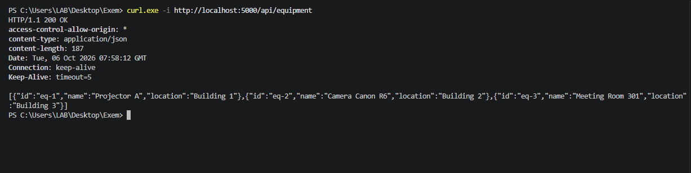
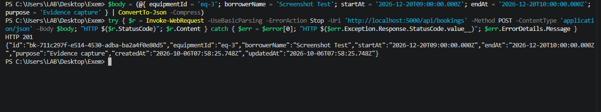
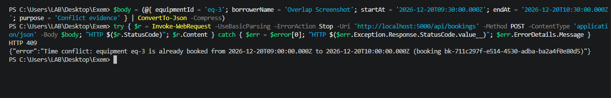
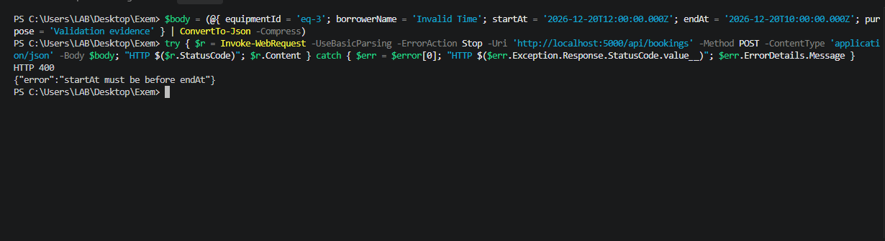
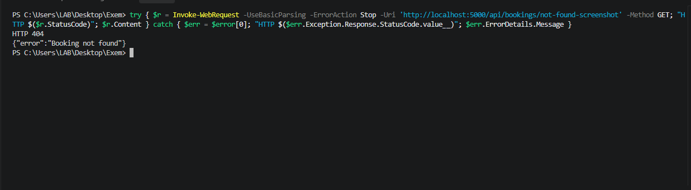
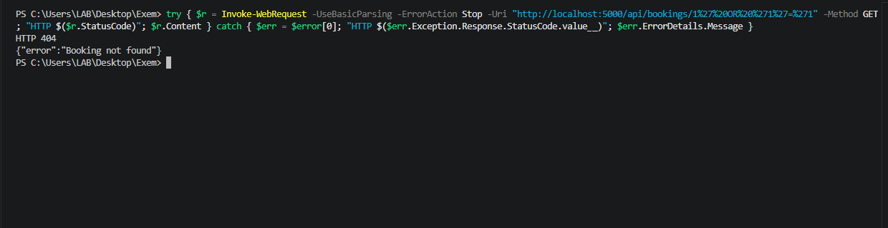

# Campus Equipment Booking API

Midterm Practical Lab - Platform Development (2026).
REST API for reserving shared equipment (projectors, cameras, meeting rooms) that **prevents overlapping bookings** for the same equipment.

- **Stack:** Node.js, TypeScript, Hono, SQLite (`sqlite3`), `dotenv`
- **Base URL used for testing:** `http://localhost:5000/api`
- **Cloudflare API:** `https://campus-equipment-booking-api.6731503013.workers.dev/api`
- **Simple UI:** [public/index.html](public/index.html)
- **Contract:** see [API_CONTRACT.md](API_CONTRACT.md) | **AI use:** [AI_LOG.md](AI_LOG.md) | **Review:** [QUALITY_GATE_REVIEW.md](QUALITY_GATE_REVIEW.md)
- **Supporting documents:** [curl_test_guide.md](docs/curl_test_guide.md), [exam_brief_en.md](docs/exam_brief_en.md), [rubric_en.md](docs/rubric_en.md), and [quality_gate.md](docs/quality_gate.md)

## Setup & run

Requires Node.js 20.17+.

```bash
npm install
npm start               # runs the TypeScript + Hono server
npm run build           # type-checks and compiles to dist/
```

The server creates `bookings.db` automatically, creates the tables and seeds 3 equipment rows (`eq-1`, `eq-2`, `eq-3`).

The deployed Cloudflare Worker uses the same Hono + TypeScript routes with
Cloudflare D1 instead of the local `sqlite3` database. To deploy it again:

```bash
npx wrangler login
npm run d1:migrate -- --remote
npm run deploy
```

The public API is available at
`https://campus-equipment-booking-api.6731503013.workers.dev/api`.

## Simple UI

Open [public/index.html](public/index.html) in a browser. It connects to the
deployed Cloudflare API by default and can also be switched to the local API.
The page lists equipment and bookings, creates bookings, and deletes bookings.

## Brief schema / ERD

See the separate [SCHEMA_ERD.md](SCHEMA_ERD.md) file for the database
relationship diagram, table definitions, seed data, and booking rules.

Optional `.env`:

```
PORT=5000
DB_FILE=./bookings.db     # use :memory: for a throw-away database
```

## Endpoints (summary)

| Method | Path | Success | Errors |
|---|---|---:|---|
| GET | `/api/equipment` | 200 | - |
| GET | `/api/bookings` (optional `?equipmentId=`) | 200 | 400 |
| GET | `/api/bookings/:id` | 200 | 404 |
| POST | `/api/bookings` | 201 | 400, 409 |
| PATCH | `/api/bookings/:id` | 200 | 400, 404, 409 |
| DELETE | `/api/bookings/:id` | 204 | 404 |

Every error is JSON: `{ "error": "message" }`.

## Project structure & design notes

- `src/server.ts` is organised in four sections: **model** (SQLite helpers), **validation**, **routes/controllers**, **404 + central error handler**.
- **SQL injection:** every query uses `?` parameter binding. No request data is concatenated into SQL (the only concatenation is constant SQL text).
- **Overlap rule:** `existing.start_at < new.end_at AND existing.end_at > new.start_at` on the same equipment. Back-to-back bookings (11:00 end, 11:00 start) are allowed. On PATCH the booking being edited is excluded.
- **Concurrency:** writes are serialised with a small mutex so two simultaneous requests cannot both pass the overlap check.
- **Dates** must be ISO 8601 with timezone and are normalised to UTC (`toISOString()`), so string comparison equals time comparison.
- **Schema/ERD:** see the ERD in [API_CONTRACT.md](API_CONTRACT.md#data-model--erd).

## Test evidence (curl)

Run the server in one terminal, then run these in another. The submitted
evidence below was collected with PowerShell against the Hono server.

```bash
BASE=http://localhost:5000/api
```

### T1 - List equipment (200)

```bash
curl -s -w "\nHTTP %{http_code}\n" $BASE/equipment
```

Expected:

```
[{"id":"eq-1","name":"Projector A","location":"Building 1"},{"id":"eq-2","name":"Camera Canon R6","location":"Building 2"},{"id":"eq-3","name":"Meeting Room 301","location":"Building 3"}]
HTTP 200
```

### T2 - Create booking (201)

```bash
curl -s -w "\nHTTP %{http_code}\n" -X POST $BASE/bookings -H "Content-Type: application/json" \
  -d '{"equipmentId":"eq-1","borrowerName":"Somchai Jaidee","startAt":"2026-10-20T09:00:00.000Z","endAt":"2026-10-20T11:00:00.000Z","purpose":"Class presentation"}'
# save the id for later tests
ID=$(curl -s -X POST $BASE/bookings -H "Content-Type: application/json" \
  -d '{"equipmentId":"eq-2","borrowerName":"Malee Rakdee","startAt":"2026-10-21T09:00:00.000Z","endAt":"2026-10-21T10:00:00.000Z","purpose":"Photo shoot"}' \
  | sed -n 's/.*"id":"\([^"]*\)".*/\1/p')
echo $ID
```

Expected: `HTTP 201` and a body like `{"id":"bk-<uuid>","equipmentId":"eq-1","borrowerName":"Somchai Jaidee","startAt":"2026-10-20T09:00:00.000Z","endAt":"2026-10-20T11:00:00.000Z","purpose":"Class presentation","createdAt":"...","updatedAt":"..."}`

### T3 - Read one booking (200) and list (200)

```bash
curl -s -w "\nHTTP %{http_code}\n" $BASE/bookings/$ID
curl -s -w "\nHTTP %{http_code}\n" "$BASE/bookings?equipmentId=eq-1"
```

Expected: `HTTP 200` with the booking object / an array containing only `eq-1` bookings.

### T4 - Update booking (200)

```bash
curl -s -w "\nHTTP %{http_code}\n" -X PATCH $BASE/bookings/$ID -H "Content-Type: application/json" \
  -d '{"purpose":"Photo shoot (updated)"}'
```

Expected: `HTTP 200`, `"purpose":"Photo shoot (updated)"`, other fields unchanged.

### T5 - Overlapping create is rejected (409)

```bash
curl -s -w "\nHTTP %{http_code}\n" -X POST $BASE/bookings -H "Content-Type: application/json" \
  -d '{"equipmentId":"eq-1","borrowerName":"Somying","startAt":"2026-10-20T10:00:00.000Z","endAt":"2026-10-20T12:00:00.000Z"}'
```

Expected:

```
{"error":"Time conflict: equipment eq-1 is already booked from 2026-10-20T09:00:00.000Z to 2026-10-20T11:00:00.000Z (booking bk-...)"}
HTTP 409
```

### T6 - Back-to-back booking is allowed (201) and PATCH into overlap is rejected (409)

```bash
curl -s -w "\nHTTP %{http_code}\n" -X POST $BASE/bookings -H "Content-Type: application/json" \
  -d '{"equipmentId":"eq-1","borrowerName":"Somying","startAt":"2026-10-20T11:00:00.000Z","endAt":"2026-10-20T12:00:00.000Z"}'
# take the id of that new booking as ID2, then try to move it back into the first slot:
curl -s -w "\nHTTP %{http_code}\n" -X PATCH $BASE/bookings/$ID2 -H "Content-Type: application/json" \
  -d '{"startAt":"2026-10-20T10:00:00.000Z"}'
```

Expected: first call `HTTP 201`, second call `HTTP 409` with a "Time conflict" message.

### T7 - Start time not before end time (400)

```bash
curl -s -w "\nHTTP %{http_code}\n" -X POST $BASE/bookings -H "Content-Type: application/json" \
  -d '{"equipmentId":"eq-1","borrowerName":"Test","startAt":"2026-10-22T12:00:00.000Z","endAt":"2026-10-22T10:00:00.000Z"}'
```

Expected: `{"error":"startAt must be before endAt"}` + `HTTP 400`

### T8 - Unknown equipment (400), missing field (400), bad date (400), malformed JSON (400)

```bash
curl -s -w "\nHTTP %{http_code}\n" -X POST $BASE/bookings -H "Content-Type: application/json" \
  -d '{"equipmentId":"eq-999","borrowerName":"Test","startAt":"2026-10-22T10:00:00.000Z","endAt":"2026-10-22T11:00:00.000Z"}'
curl -s -w "\nHTTP %{http_code}\n" -X POST $BASE/bookings -H "Content-Type: application/json" -d '{"equipmentId":"eq-1"}'
curl -s -w "\nHTTP %{http_code}\n" -X POST $BASE/bookings -H "Content-Type: application/json" \
  -d '{"equipmentId":"eq-1","borrowerName":"Test","startAt":"tomorrow","endAt":"2026-10-22T11:00:00.000Z"}'
curl -s -w "\nHTTP %{http_code}\n" -X POST $BASE/bookings -H "Content-Type: application/json" -d '{bad json'
```

Expected (all `HTTP 400`): `equipmentId "eq-999" does not exist` / `borrowerName is required` / `startAt must be an ISO 8601 date-time...` / `Malformed JSON in request body`

### T9 - Not found (404)

```bash
curl -s -w "\nHTTP %{http_code}\n" $BASE/bookings/does-not-exist
curl -s -w "\nHTTP %{http_code}\n" -X DELETE $BASE/bookings/does-not-exist
curl -s -w "\nHTTP %{http_code}\n" -X PATCH $BASE/bookings/does-not-exist -H "Content-Type: application/json" -d '{"purpose":"x"}'
```

Expected: `{"error":"Booking not found"}` + `HTTP 404` for each.

### T10 - Delete (204), then confirm it is gone (404)

```bash
curl -s -o /dev/null -w "HTTP %{http_code}\n" -X DELETE $BASE/bookings/$ID
curl -s -w "\nHTTP %{http_code}\n" $BASE/bookings/$ID
```

Expected: `HTTP 204` (empty body), then `{"error":"Booking not found"}` + `HTTP 404`.

### T11 - SQL injection attempt is treated as plain data

```bash
curl -s -w "\nHTTP %{http_code}\n" "$BASE/bookings/1'%20OR%20'1'='1"
```

Expected: `{"error":"Booking not found"}` + `HTTP 404` (no rows leaked, no SQL error).

### Results summary

| # | Case | Expected | Actual result |
|---|---|---:|---|
| T1 | List equipment | 200 | PASS - HTTP 200 from TypeScript + Hono |
| T2 | Create | 201 | PASS - HTTP 201; created `bk-16ba59b8-113f-4a33-8891-71c3028c2617` |
| T3 | Read one / list | 200 | PASS - GET one HTTP 200; list HTTP 200 returned the same booking |
| T4 | Update | 200 | PASS - HTTP 200; `purpose` updated and other fields preserved |
| T5 | Overlap on create | 409 | PASS - HTTP 409 from TypeScript + Hono |
| T6 | Back-to-back 201 / overlap on PATCH 409 | 201 / 409 | PASS - back-to-back HTTP 201; PATCH overlap HTTP 409 |
| T7 | start >= end | 400 | PASS - HTTP 400 from TypeScript + Hono |
| T8 | Unknown equipment / missing / bad date / bad JSON | 400 | PASS - all four validation cases returned HTTP 400 |
| T9 | Not found (GET/PATCH/DELETE) | 404 | PASS - GET, PATCH, and DELETE each returned HTTP 404 |
| T10 | Delete | 204 -> 404 | PASS - DELETE HTTP 204 with empty body; follow-up GET HTTP 404 |
| T11 | SQL injection string | 404 | PASS - HTTP 404; no data leaked or SQL error |

## Test Evidence (current TypeScript + Hono run)

The current server was tested at `http://localhost:5000/api`. The results below
are the authoritative evidence for the submitted TypeScript + Hono implementation.

| Test | Verified result |
|---|---|
| T1 | `GET /api/equipment` -> HTTP 200; returned `eq-1`, `eq-2`, and `eq-3`. |
| T2 | `POST /api/bookings` -> HTTP 201; created `bk-16ba59b8-113f-4a33-8891-71c3028c2617`. |
| T3 | GET one booking and filtered list -> HTTP 200; both returned the created booking. |
| T4 | PATCH booking -> HTTP 200; `purpose` changed to `Updated by Hono PATCH`. |
| T5 | Overlapping POST -> HTTP 409. |
| T6 | Back-to-back POST -> HTTP 201; overlapping PATCH -> HTTP 409. |
| T7 | `startAt` after `endAt` -> HTTP 400. |
| T8 | Unknown equipment, missing field, bad date, and malformed JSON -> HTTP 400. |
| T9 | Unknown GET/PATCH/DELETE booking ID -> HTTP 404. |
| T10 | DELETE -> HTTP 204 with empty body; follow-up GET -> HTTP 404. |
| T11 | SQL injection string -> HTTP 404; no data leaked or SQL error. |

### Current Hono screenshots












