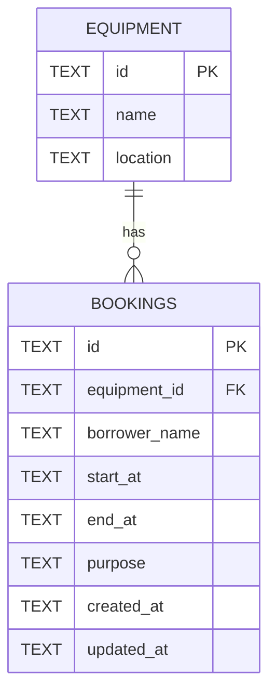

# Database Schema / ERD

## Relationship

One equipment item can have many bookings. Each booking belongs to exactly one
equipment item.



## Tables

### `equipment`

| Column | Type | Constraint | Description |
|---|---|---|---|
| `id` | TEXT | Primary key | Equipment identifier |
| `name` | TEXT | Required | Equipment name |
| `location` | TEXT | Required | Location of the equipment |

Seed equipment:

| ID | Name | Location |
|---|---|---|
| `eq-1` | Projector A | Building 1 |
| `eq-2` | Camera Canon R6 | Building 2 |
| `eq-3` | Meeting Room 301 | Building 3 |

### `bookings`

| Column | Type | Constraint | Description |
|---|---|---|---|
| `id` | TEXT | Primary key | Booking identifier |
| `equipment_id` | TEXT | Required foreign key | References `equipment.id` |
| `borrower_name` | TEXT | Required | Name of the borrower |
| `start_at` | TEXT | Required | ISO 8601 timestamp in UTC |
| `end_at` | TEXT | Required | ISO 8601 timestamp in UTC |
| `purpose` | TEXT | Required, default `''` | Reason for the booking |
| `created_at` | TEXT | Required | Creation timestamp in UTC |
| `updated_at` | TEXT | Required | Last update timestamp in UTC |

## Business rules

- `start_at` must be earlier than `end_at`.
- A booking must reference an existing equipment item.
- Bookings for the same equipment cannot overlap.
- The overlap condition is:

  ```text
  existing.start_at < new.end_at
  AND existing.end_at > new.start_at
  ```

- Back-to-back bookings are allowed. For example, one booking ending at
  `11:00` and another starting at `11:00` do not overlap.
- The foreign key uses `ON DELETE RESTRICT`, so equipment cannot be deleted
  while bookings reference it.
- An index on `(equipment_id, start_at, end_at)` supports overlap checks.
